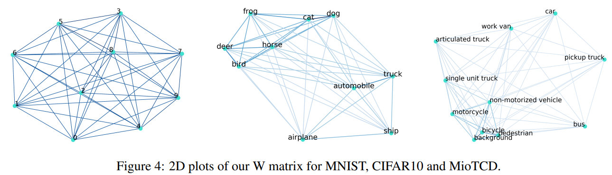
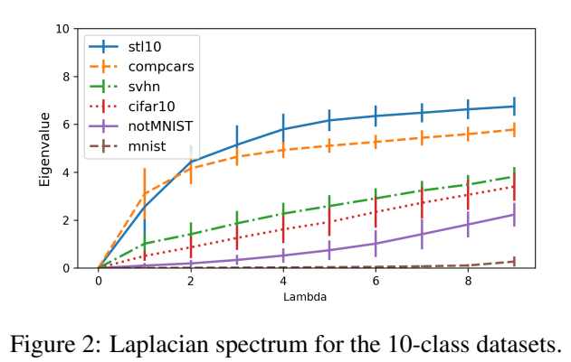

# Cumulative Spectral Gradient (CSG) metric

This library provides an implementation of CSG, from CVPR 2019 paper: Spectral Metric for Dataset Complexity Assessment.

Paper: https://arxiv.org/abs/1905.07299

CSG is a measure which estimates the complexity of a dataset by combining probability product kernel (Jebara et al.) and
Graph Theory. By doing so, one can estimate the complexity of their dataset without training a model.

For the experiment part of the repo, please see [./experiments/README.md](./experiments/README.md)
To see the library in action, here's a "real-life" usecase in [this notebook](./notebooks/clinc_oos.ipynb).



## How to use

This library works with two arrays, the features and the labels. The features are ideally normalized and have
low-dimensionality. In the paper, we use t-SNE to reduce the dimensionality.

```python
from spectral_metric.estimator import CumulativeGradientEstimator
from spectral_metric.visualize import make_graph

X, y = ...  # Your dataset with shape [N, ?], [N]
estimator = CumulativeGradientEstimator(M_sample=250, k_nearest=5)
estimator.fit(data=X, target=y)
csg = estimator.csg  # The actual complexity values.
estimator.evals, estimator.evecs  # The eigenvalues and vectors.

# You can plot the dataset with:
make_graph(estimator.difference, "Your dataset", ["A", "B", "C"])
```

## Support

For support, please submit an issue!

# Results

We can compare multiple datasets without training any classifier.
For example, we can plot the eigenvalues of the datasets, the
higher the values are, the harder the dataset is.



**Note:** The actual CSG is based on the gradient of the eigenvalues,
this is done to overcome issues where the first classes are easy to separate, but not the last ones.

Please see the paper for more details.
